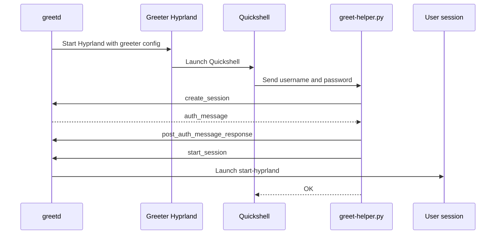

 # greetd + Quickshell Greeter

A minimal Wayland login screen built with [greetd](https://git.sr.ht/~kennylevinsen/greetd), [Hyprland](https://hyprland.org/), and [Quickshell](https://quickshell.org/).

greetd remains responsible for authentication and starting the user session. A temporary Hyprland session provides the Wayland compositor, while Quickshell renders the fullscreen password prompt.

> This is a minimal example and is not a complete desktop lock screen. Review the security and authentication limitations before using it on a production system.

## Features

- Fullscreen Quickshell password prompt
- Keyboard-focused layer-shell surface
- Password authentication through greetd's socket protocol
- Starts the real Hyprland session after successful authentication
- Small, easy-to-customize QML UI

## Project Layout

```text
.
├── greetd/
│   ├── config.toml                  # greetd service configuration
│   ├── hyprland-greet.lua           # temporary Hyprland greeter session
│   └── quickshell-greeter/
│       ├── greet-helper.py          # greetd socket protocol bridge
│       ├── GreeterState.qml         # authentication and session state
│       ├── qmldir                   # QML singleton registration
│       └── shell.qml                # fullscreen login UI
├── explaination.md                  # implementation notes
└── README.md
```

## Requirements

Install and configure the following on a Wayland system:

- greetd
- Hyprland with Lua configuration support
- Quickshell with the `Quickshell.Wayland` and `Quickshell.Io` modules
- Python 3
- PAM configured for the user login

The commands and package names depend on your distribution. Make sure the `greeter` user exists and can start Hyprland and Quickshell.

## Installation

The example expects its runtime files under `/etc/greetd`.

1. Copy the project files into `/etc/greetd`:

	```bash
	sudo cp greetd/config.toml /etc/greetd/config.toml
	sudo cp greetd/hyprland-greet.lua /etc/greetd/hyprland-greet.lua
	sudo cp -r greetd/quickshell-greeter /etc/greetd/quickshell-greeter
	```

2. Make the helper executable:

	```bash
	sudo chmod +x /etc/greetd/quickshell-greeter/greet-helper.py
	```

3. Set the login username in `GreeterState.qml`:

	```qml
	readonly property string username: "your_username"
	```

4. Check the session command. The default is:

	```qml
	readonly property var sessionCmd: ["start-hyprland"]
	```

	Keep `start-hyprland` if it is available on your system. Otherwise, replace it with the command that should start your desktop session.

5. Enable and start greetd using your distribution's service manager. For systemd:

	```bash
	sudo systemctl enable greetd
	sudo systemctl restart greetd
	```

## Configuration

### greetd

[`greetd/config.toml`](greetd/config.toml) starts the temporary greeter compositor as the `greeter` user:

```toml
vt = 1

[default_session]
command = "Hyprland -c /etc/greetd/hyprland-greet.lua"
user = "greeter"
```

Change the VT, executable paths, or greeter user if your system requires it.

### Temporary Hyprland session

[`greetd/hyprland-greet.lua`](greetd/hyprland-greet.lua) configures one preferred monitor and launches Quickshell when Hyprland starts:

```lua
hl.on("hyprland.start", function()
	 hl.exec_cmd("qs -c /etc/greetd/quickshell-greeter")
end)
```

This is a throwaway compositor session used only to display the login screen. It is separate from the user's real desktop session.

### Quickshell UI

Edit [`greetd/quickshell-greeter/shell.qml`](greetd/quickshell-greeter/shell.qml) to customize the prompt, colors, fonts, layout, and error messages.

[`GreeterState.qml`](greetd/quickshell-greeter/GreeterState.qml) contains the username, session command, and authentication state. The `qmldir` file registers it as the `GreeterState` singleton used by `shell.qml`.

## Authentication Flow



The helper reads `GREETD_SOCK`, opens greetd's UNIX socket, and sends the JSON protocol messages required to authenticate and start the session. It reports `OK` on success or `FAIL:<reason>` on failure.

## Troubleshooting

### The greeter does not appear

Check the greetd service log:

```bash
sudo journalctl -u greetd -b
```

Then verify that the `greeter` user can access Hyprland, Quickshell, the configured monitor, and all files under `/etc/greetd`.

### `GREETD_SOCK not set`

The Python helper must run as a child of the greetd greeter session. Running `greet-helper.py` manually from a normal terminal will not provide `GREETD_SOCK` and is expected to fail.

### Authentication always fails

- Confirm that `username` matches the account being logged into.
- Check the account's PAM configuration.
- Look for the detailed error in `journalctl -u greetd -b`.
- Confirm that the helper is receiving the password through its standard input.

### The desktop session does not start

Verify that the configured command exists for the authenticated user:

```bash
command -v start-hyprland
```

Use the correct session command in `GreeterState.qml`, and do not launch the temporary greeter command again as the real user session.

## Limitations and Security Notes

- The username is hardcoded in `GreeterState.qml`.
- The example assumes a simple password-based PAM flow and sends the same password for every auth prompt. MFA and non-password prompts need a dedicated implementation.
- The password is passed from QML to the helper through standard input and then to greetd's authentication protocol. Keep the helper and QML files readable only by users who should be able to inspect the greeter configuration.
- This project is a login greeter, not a session-lock protocol implementation. It should not be treated as a lock screen for an already-running desktop session.
- Test changes from a recovery console or SSH session so a broken greeter configuration does not leave the machine without a graphical login.